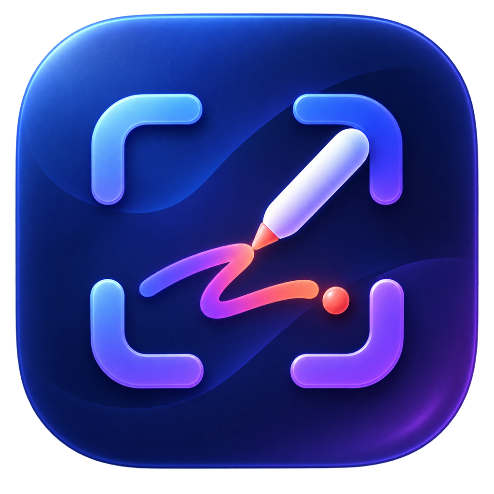
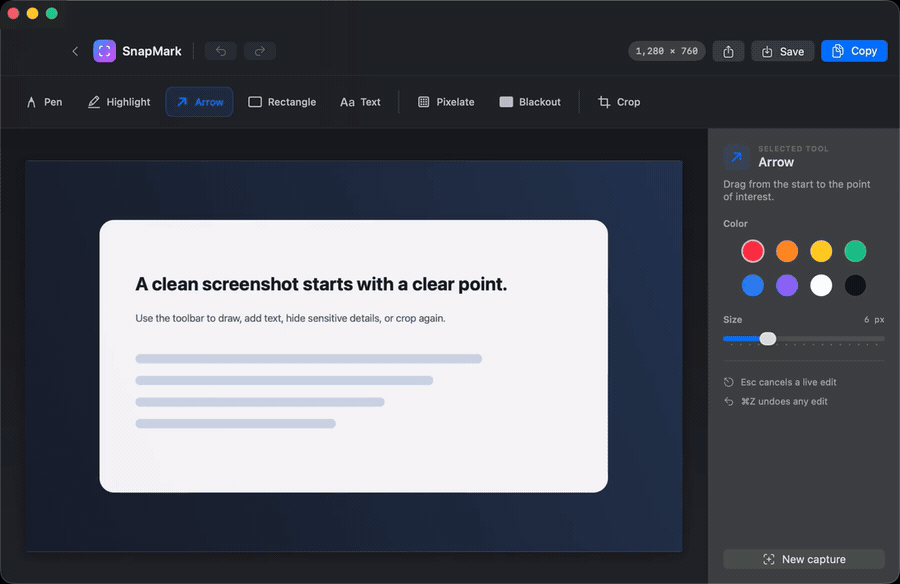

<p align="center">
  
</p>

<h1 align="center">SnapMark</h1>

<p align="center">A local-first screenshot and annotation app for macOS.</p>

<p align="center">
  <a href="https://github.com/perevernihata/snap-mark/actions/workflows/ci.yml"></a>
  <a href="https://github.com/perevernihata/snap-mark/releases/latest"></a>
  
  <a href="LICENSE"></a>
</p>

I built SnapMark because I was sick of being asked to pay a licence fee for something as basic as taking a screenshot. That is nonsense. This is the free drop-in replacement I use on my own Mac, and it works. No subscription, no account, no upload.

SnapMark captures one area across display boundaries or a specific window, then opens it in a focused editor. Crop, draw, highlight, add shapes and text, hide details, copy, save, or share without uploading the image anywhere.

## See it in action

<p align="center">
  <a href="docs/media/snapmark-demo.mp4">
    
  </a>
</p>

The demo uses SnapMark's built-in synthetic image. It contains no real desktop, account, file, message, or capture. Click the animation to open the MP4.

## Download

Download the latest universal macOS build from [GitHub Releases](https://github.com/perevernihata/snap-mark/releases/latest). It supports Apple Silicon and Intel Macs.

Each release includes:

- `SnapMark.zip`
- `SnapMark.zip.sha256`

Verify the download from the directory that contains both files:

```sh
shasum -a 256 -c SnapMark.zip.sha256
```

Then expand the ZIP and move `SnapMark.app` into `/Applications`.

Community builds are code-signed but not Apple-notarized. On first launch, Control-click SnapMark, choose **Open**, then confirm. macOS may instead offer **Open Anyway** under **System Settings > Privacy & Security**. The source and build workflow are public so the binary can be reproduced and inspected.

SnapMark needs Screen Recording permission to capture the desktop. It does not need Accessibility permission.

## Capture

1. Open SnapMark and click **Capture area**, or press `Control-Shift-Command-4` from any app.
2. Drag a region across any connected display. Release to capture or press `Escape` to cancel.
3. Use **Capture window** when you want the native macOS window picker.

A 3, 5, or 10 second delay is available from the home screen. Capture preparation has a Cancel action and a deadline, so a stalled system capture cannot leave the app spinning forever.

## Edit

| Key | Tool | Use |
| --- | --- | --- |
| `P` | Pen | Draw a freehand line. |
| `H` | Highlight | Add a wide translucent stroke. |
| `A` | Arrow | Drag toward the point of interest. |
| `R` | Rectangle | Draw an outlined box. |
| `T` | Text | Click and type. Drag while typing to move it, then press Return. |
| `B` | Pixelate | Hide a selected area with coarse pixels. |
| `X` | Blackout | Replace selected pixels with solid black in exported output. |
| `C` | Crop | Drag the area to keep. The crop applies on release. |

Use `Command-Z` and `Shift-Command-Z` for undo and redo. **Copy** writes a flattened PNG to the clipboard. **Save** writes PNG or JPEG. The Share button opens the standard macOS share sheet.

## Privacy

SnapMark has no account, analytics, cloud service, or network client. Captures and edits stay on the Mac.

Recent history is enabled by default and keeps up to 30 raw PNG captures under:

```text
~/Library/Application Support/SnapMark/Captures
```

Pixelate and blackout are flattened into copied and saved output, but the raw Recent capture still contains the original pixels. Disable history before capturing sensitive material or remove the original from the capture folder afterward.

The bundled [privacy manifest](Packaging/PrivacyInfo.xcprivacy) declares app-only preferences and the file timestamps displayed for Recent captures. It declares no tracking and no collected data.

## Build from source

Requirements:

- macOS 14 or later
- Swift 6 from Xcode or Apple Command Line Tools

```sh
git clone https://github.com/perevernihata/snap-mark.git
cd snap-mark
make check
make test
make package
make verify-package
```

`make test` treats warnings as errors and runs 30 deterministic tests. `make package` builds a universal arm64 and Intel app with an explicit ad-hoc signature. Maintainers with the stable local signing files use `make app` instead.

The application is a Swift Package with a SwiftUI shell and AppKit capture overlays and editor canvas. It has no third-party runtime dependencies. See [Architecture](docs/ARCHITECTURE.md) for the component boundaries and [Testing](docs/TESTING.md) for the current regression coverage.

## Project scope

The current release includes area and window capture, delayed capture, a global shortcut, local history, annotation, redaction, crop, clipboard export, PNG and JPEG saving, sharing, undo, redo, and VoiceOver labels.

Scrolling capture, OCR, video recording, pinning, cloud upload, and editable project files are not implemented. The original product benchmark is in [docs/research/screenshot-app-benchmark.md](docs/research/screenshot-app-benchmark.md).

## Contributing and security

Read [CONTRIBUTING.md](CONTRIBUTING.md) before opening a pull request. Report vulnerabilities through the private process in [SECURITY.md](SECURITY.md), not a public issue.

SnapMark is available under the [MIT License](LICENSE).
